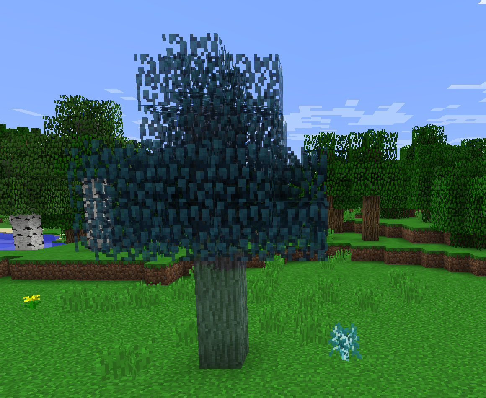

# Spectre Sapling

## Description

---

Created by right-clicking a vanilla sapling with [Ectoplasm](../items/ectoplasm). When planted it grows into a spectre tree. The logs can be used to craft various [Spectre Plank](../blocks/spectre-wood) blocks. The leaves can be used to farm [Ectoplasm](../items/ectoplasm). While you should come out with a surplus of Ectoplasm from leaves, chance-wise you might need a bunch of saplings to really get started farming Ectoplasm.

Spectre Saplings can be grown using Thermal Expansion's Insolator, providing an automated way to farm Ectoplasm, though you will lose the sapling in the process. The Spectre Sapling can be enabled or disabled in the config menu. If disabled, the sapling will not grow and cannot be created from regular saplings. The chance of a Spectre Sapling dropping an Ectoplasm when broken is also configurable.

## Screenshots

---

## Videos

---

<video controls>
  <source src="../videos/spectre-sapling-1.mp4" type="video/mp4">
</video>
