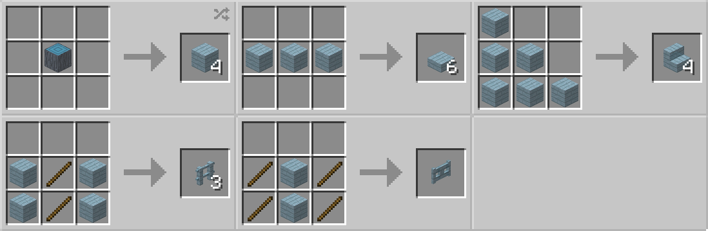
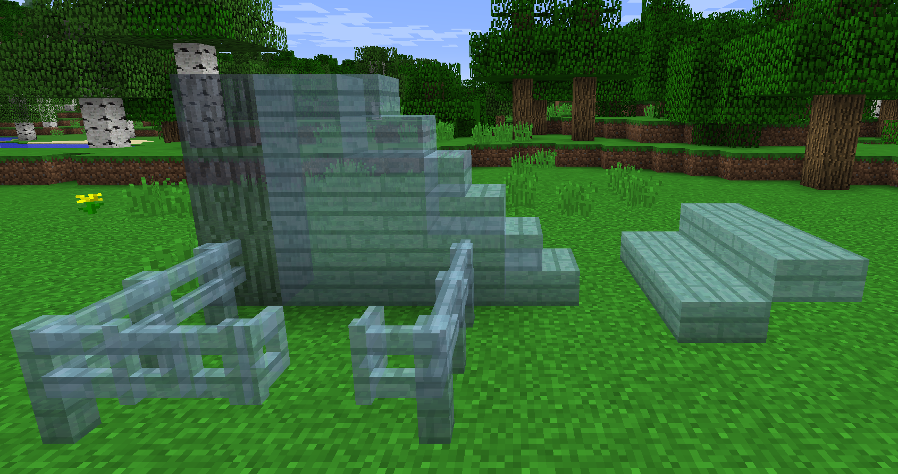

# Spectre Wood

## Description

---

Spectre Wood is a wood type that can be crafted from Spectre Logs of a [Spectre Tree](../blocks/spectre-tree). It can be used to craft various blocks, such as Slabs, Stairs, Fences and Fence Gates. Spectre Wood is translucent.

## Crafting

---

## Screenshots

---

