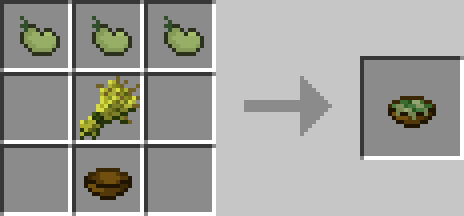
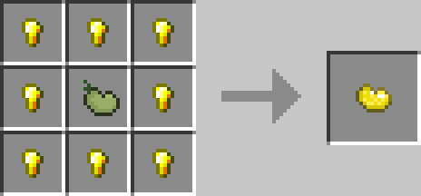

<!-- TODO: Verify bean growth mechanics and drop rates -->
---
title: Beans
category: items
---

# Beans

## Description

---

While exploring the world, you might stumble across wild bean plants. Break them to collect beans that you can replant to start your own bean farm. Beans are pretty versatile - you can cook them into Bean Stew (which is slightly better than mushroom stew) or craft them into Lesser Magic Beans.

Plant a Lesser Magic Bean and watch as a Bean Stalk grows upward, continuing until it hits a solid block. These stalks work like ladders, so you can quickly climb up them to reach high places. The stalk itself goes through 8 growth stages before it's fully mature. When it's ready, right-click it to harvest and get 1-2 beans back.

If you're lucky enough to find a Nature Core, the chest next to it always contains a Magic Bean. This is the upgraded version - when you plant it, the Bean Stalk will grow all the way to the world's height limit, breaking through any blocks in its path. When it reaches the top, a Bean Pod forms at the very top. Break this pod to get a treasure trove of rewards: beans, iron, gold, diamonds, and emeralds in random amounts. It's like hitting the jackpot after a long climb!

## Crafting

---

## Videos

---

<video controls>
  <source src="../videos/beans.mp4" type="video/mp4">
</video>