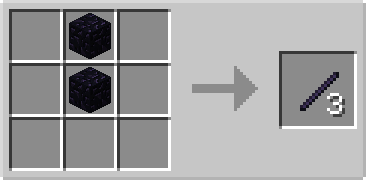
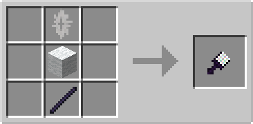
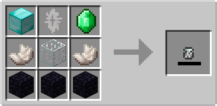

# Biome Painter

## Description

---

The Biome Painter allows you to change the biome of a collumn of blocks. To use it, you need a with charges somewhere in your inventory. Right-click on a block to change its biome to match the biome stored in the capsule. Each use consumes one charge from the capsule.

The Biome Capsule stores biome charges that power the Biome Painter. To charge it, drop it on the ground in the biome you want to capture. After a short delay, it will lock onto that biome and begin charging. The capsule charges slowly over time and will only charge when it remains in the same biome it's locked to. It will emit colored particles while charging. While on the ground, it will never despawn. Once charged, pick up the capsule and use it with the Biome Painter. When all charges are used up, you'll need to charge the capsule again.

## Crafting

---

