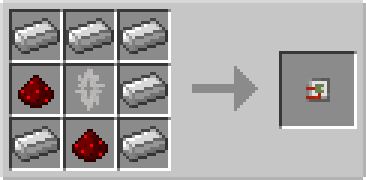
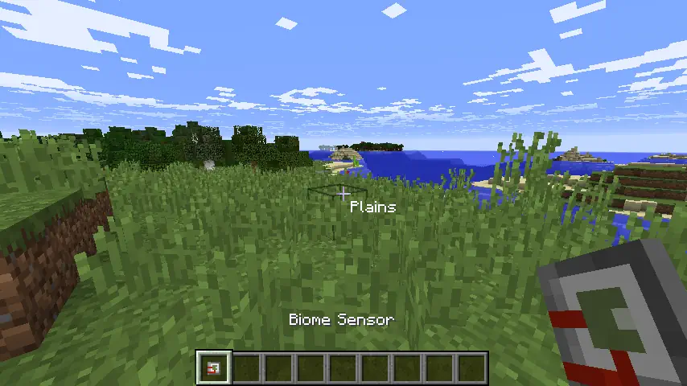

# Biome Sensor

## Description

---

The Biome Sensor is a handheld item that displays the current biome name on your HUD when held. The sensor's screen changes color to match the biome you're currently in.

## Crafting

---

## Screenshots

---

