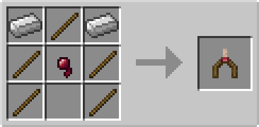
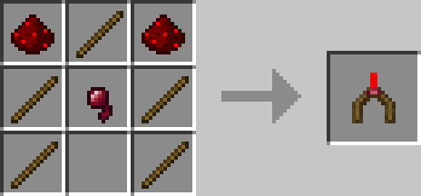

# Divining Rods

## Description

---

Holding a divining rod in your main or off hand will show you nearby ore through walls. The range is is a 11x11x11 cube centered on you.

The basic divining rods only show you one ore while the vanilla one shows all vanilla ores at once.

Depending on the mods you have installed more divining rods might be available, if you would like one to be added for another mods ores feel free to create an issue on github.

## Crafting

---

## Screenshots

---

<video controls>
  <source src="https://lumien.net/rtwiki/images/screenshots/divining-rods.mp4" type="video/mp4">
</video>