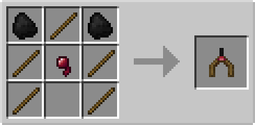
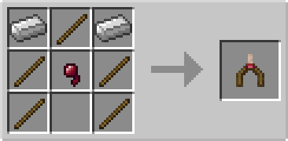
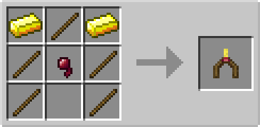
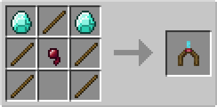
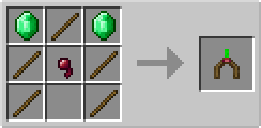
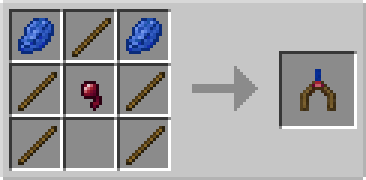
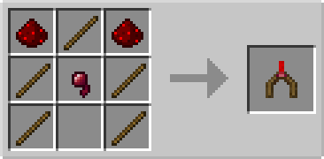
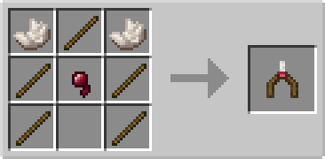
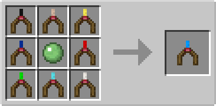

# Divining Rods

## Description

---

Holding a divining rod in your main or off hand will show you nearby ore through walls. The detection range is configurable in the config menu (default is an 11x11x11 cube centered on you).

The basic divining rods only show you one ore type while the universal one shows all supported ores at the same time.

## Configuration

The detection range of divining rods can be adjusted in the config menu. You can also add, remove, or disable divining rods through the config menu to customize which rods are available in your game.

## Supported Mods

Divining Rods support ores from many mods, including:

- Vanilla Minecraft ores
- Thermal Foundation
- Draconic Evolution
- Tinkers' Construct
- Actually Additions
- Applied Energistics
- Silent's Gems
- Galacticraft & Galacticraft Planets
- Advent of Ascension
- Aether & Aether II (partial support)
- DivineRPG
- NetherEnding Ores

Some mods (Silent Gear, More Planets, Aether, Aether II) have sleeper support for mods that don't provide oreDict entries. This feature is disabled by default and can be enabled by modpacks by adding the relevant oreDict entries.

## Crafting

---

## Videos

---

<video controls>
  <source src="../videos/divining-rods.mp4" type="video/mp4">
</video>