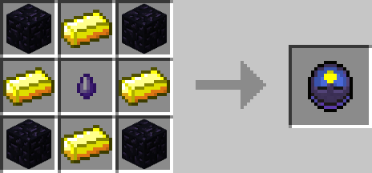
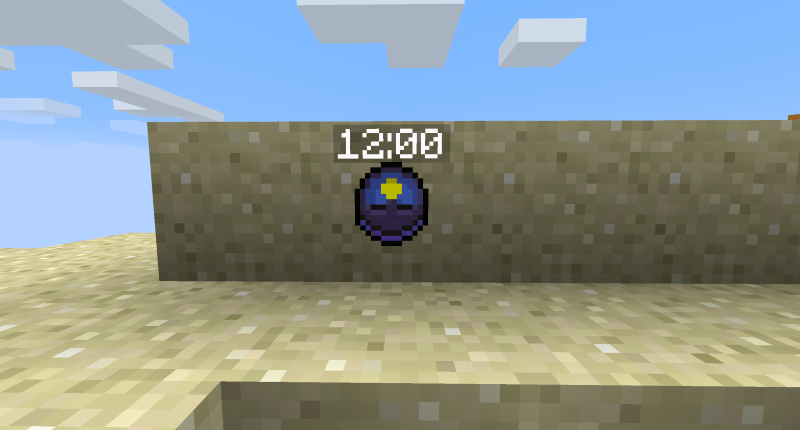

# Eclipsed Clock

## Description

---

An eclipsed clock allows you to change the time of day. After you hang it on a wall you can (shift) right click it to decrease and increase its target time. Hovering over it with a [Time in a Bottle](time-in-a-bottle.html) in your hand will display the time necessary to fast forward to the set time. Right clicking it with the Time in a Bottle will consume that amount of time from the bottle and set the time of day to that of the clock.

## Crafting

---

## Screenshots

---

