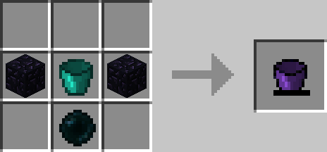

# Ender Bucket

## Description

---

An Ender Bucket works mostly like a normal Iron Bucket. However when you right click a non source block it will try to find the closest connected source block and pick that up instead of doing nothing.

The Reinforced version can hold 10 Buckets of Fluid instead of just one. Also when you hold shift while picking up fluids it won’t stop after it finds one source block but will keep going until it is either full or there is no fluid left.

## Crafting

---

