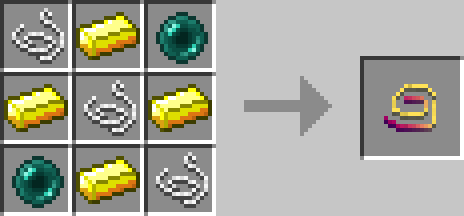

# Escape Rope

## Description

---

Holding right click with an Escape Rope in your hand while in a cave will make it search for a way to the surface. Once it finds one you will be teleported there and the rope takes some damage. Depending on the size of the cave the search might take up to a minute. You have to keep holding right click while it searches. You can use it 21 times before it breaks.

## Crafting

---

## Videos

---

<video controls>
  <source src="../videos/escape-rope.mp4" type="video/mp4">
</video>