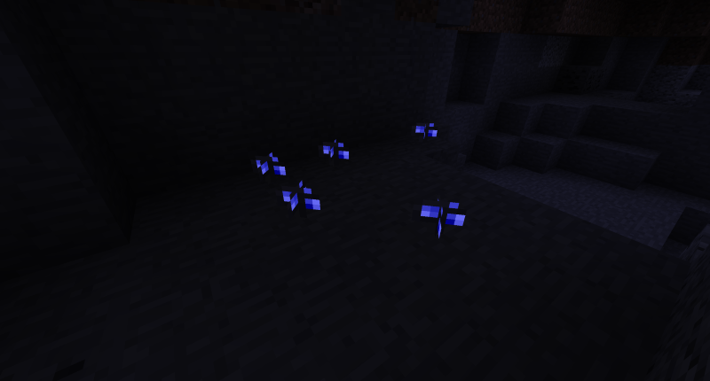

# Glowing Mushrooms

## Description

---

Glowing Mushrooms can be found in caves, they can be used as a replacement for glowstone in **all** brewing recipes and are also used to craft [Luminous Powder](luminous-powder).

## Screenshots

---

