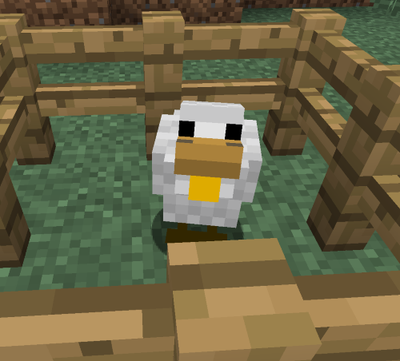

# Golden Egg

## Description

---

Golden Eggs can be found inside of Bean Pods, grown from [Magic Beans](beans). When thrown, a Chicken with a Golden Wattle will hatch. You can feed the Golden Chicken gold ore to make it drop 3 gold ingots per ore. Alongside that, it can also be configured to lay golden ingots instead of eggs.

## Screenshots

---

