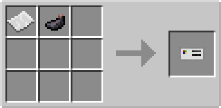

# ID Card

## Description

---

The ID Card is used to identify specific players for various systems. Right-clicking with an ID Card in your hand will bind it to your player profile, storing your name and unique identifier.

ID Cards are used with the Global [Chat Detector](../blocks/chat-detector) to enable message consumption mode. When a Global Chat Detector is set to consume messages, it requires an ID Card matching the player who typed the message in order to prevent the message from appearing in chat.

ID Cards are also used with the [Emerald Compass](emerald-compass) to track players.

## Crafting

---

