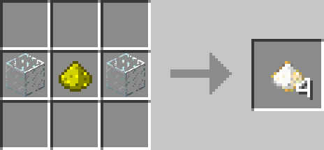
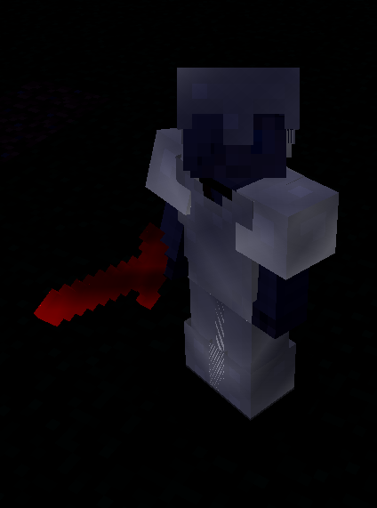

# Luminous Powder

## Description

---

Luminous Powder is primarily a crafting ingredient used in making [Luminous Blocks](../blocks/luminous-blocks.html) & [Luminous Stained Bricks](../blocks/stained-bricks.html). However you can also combine it with any enchanted item in a crafting table to make the enchantment glint glow in the dark.

## Crafting

---

## Screenshots

---

