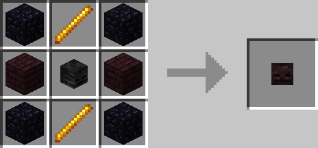
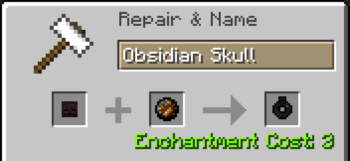

# Obsidian Skull

## Description

---

The Obsidian Skull basically grants you immunity to low fire damage. As long as its in your inventory whenever you are hit by fire damage there is a chance that it will be negated. That chance is higher the lower the damage is.

*When you have Baubles installed you can craft an Obsidian Skull Ring that has the same effect but can be worn in your ring slot.*

## Crafting

---

