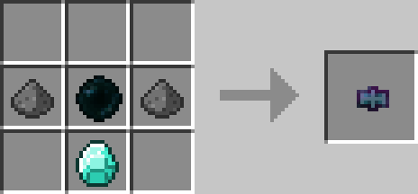

# Portkey

## Description

---

You set the target of a portkey by right clicking a block with it. When thrown on the ground the enchantment glint will vanish after 5 seconds, the portkey is now primed and won’t despawn anymore. When picked up by a player that player will be teleported to the target of the portkey (Anywhere within 2 blocks of the target to be precise). Combining the portkey with any other item in a crafting table will allow you to change the appearance of the key.

## Crafting

---

## Screenshots

---

