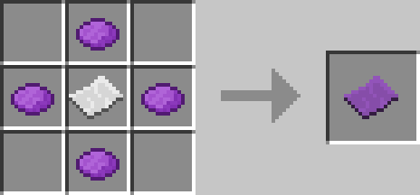

# Position Filter

## Description

---

Position Filters can store the position of a block. Right clicking on a block sets it, while holding it in your hand the selected block will show a purple cube around it.

## Crafting

---

