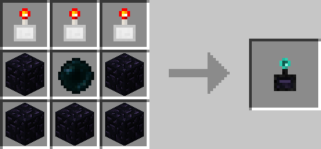

# Redstone Remote

## Description

---

The Redstone Remote is the remote / advanced version of the [Redstone Activator](redstone-activator.html). Using [Position Filters](position-filter.html) it can be linked to 9 different positions in the world which can be activated (Powered by Redstone) seperately with the click of a button. To configure it you have to hold shift while right clicking with the Remote in your hand. That will open up a gui where you can insert position filters, for every “position filter slot” there is also a ghost slot below it which specifies the icon which will be used for the button that activates that position. If you rename the Position Filters in an anvil the button will have the name of the Position Filter as a tooltip. To actually use the remote you just right click it without holding shift. Every position filter you put into it will be represented by a button, pressing it will send a 20 tick redstone pulse to the position set in the filter.

## Crafting

---

