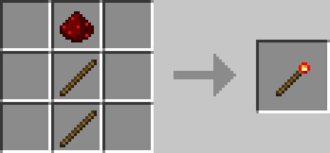

# Redstone Tool

## Description

---

The Redstone Tool is used to link blocks together for wireless redstone connections. It is used with the [Basic Redstone Interface](../blocks/redstone-interface) and [Redstone Observer](../blocks/redstone-observer) to establish connections between blocks.

To use the Redstone Tool, first right-click on the block you want to link from (such as a Basic Redstone Interface or Redstone Observer), then right-click on the target block you want to link it to. While holding a Redstone Tool, you can see these connections as red lines as long as you are close to the blocks they connect.

## Crafting

---

