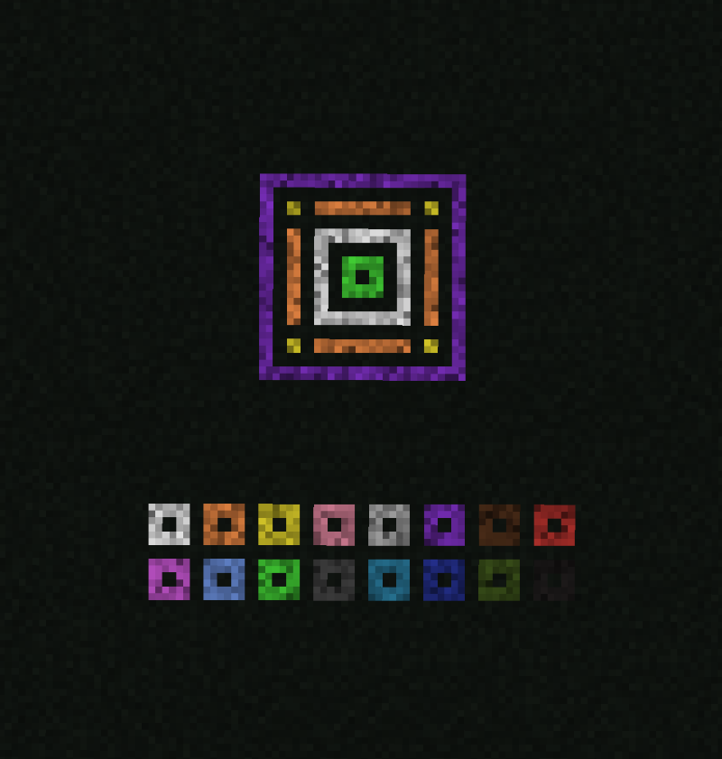

# Runic Dust

## Description

---

Runic Dust is a decorative item can be placed on top of other blocks. There is a colored version for each vanilla dye.

Right clicking Runic Dust on the ground with a piece of paper will create a Runic Pattern which you can then use to easily copy patterns onto other blocks.

## Crafting

---

## Screenshots

---

<video controls>
  <source src="https://lumien.net/rtwiki/images/screenshots/runic-dust-2.mp4" type="video/mp4">
</video>