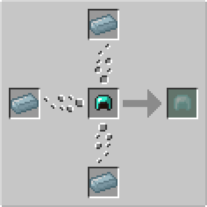

# Spectre Armor

## Description

---

Spectre Armor is a powerful set of armor crafted from Spectre Ingots and Diamond Armor. It provides superior protection compared to Diamond Armor, with slightly higher defense, durability and toughness.

### Armor Statistics

| Piece | Armor Points | Durability |
|-------|--------------|------------|
| Helmet | 3 | 385 |
| Chestplate | 9 | 560 |
| Leggings | 7 | 525 |
| Boots | 3 | 455 |
| **Full Set** | **22** | - |

The full set provides 22 armor points (2 points above Diamond Armor) but with significantly higher durability and a toughness of 3.0 (1 point above Diamond Armor's). It has an enchantability of 22, less than Gold, but more than Diamond.

### Transparency Effect

When wearing Spectre Armor pieces, your player model will become transparent. The transparency effect can be configured in two ways: In Fancy Mode (default), your transparency increases based on how many pieces of Spectre Armor you are wearing. The more pieces you put on, the more transparent your character becomes. In Simple Mode, you become 50% transparent if you are wearing the full set of Spectre Armor.

## Crafting

---

Spectre Armor pieces are crafted in the [Imbuing Station](imbuing-station). Each recipe requires 3 Spectre Ingots and 1 Diamond Armor piece to create its Spectre Armor equivalent.

**Note:** NBT data (including enchantments, durability, and other item data) is transferred from the Diamond Armor piece to the resulting Spectre Armor piece. This means you can upgrade your enchanted Diamond Armor to Spectre Armor without losing any enchantments or other item data.
