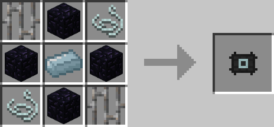
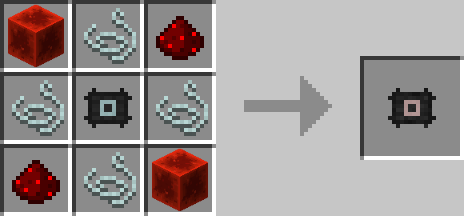
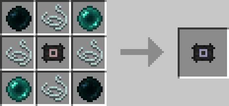

# Spectre Charger

## Description

---

When toggled on by right clicking Spectre Charger will transfer energy from your spectre energy buffer into any item in your inventory that can accept it.

The energy per tick each item gets increases with the tier.

Normal: 1024 per Tick
Redstone: 4096 per Tick
Ender: 20480 per Tick

The Genesis Charger is creative only and basically charges the items as fast as possible for free.

## Crafting

---

