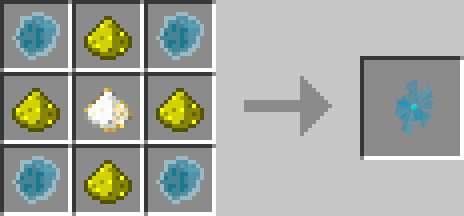
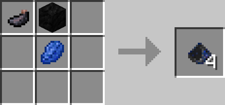

# Spectre Illuminator

## Description

---

Right clicking on the ground with this item will spawn a Spectre Illuminator that will light up the whole chunk it has been spawned in. Right click the Illuminator to get back the item and make the chunk dark again.

If you can't reach the spectre illuminator you can also craft a piece of blackout powder and right click on a block in the illuminated chunk to get it back.

## Crafting

---

## Videos

---

<video controls>
  <source src="../videos/spectre-illuminator.mp4" type="video/mp4">
</video>