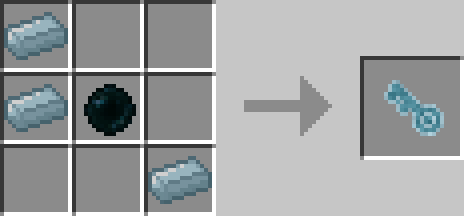
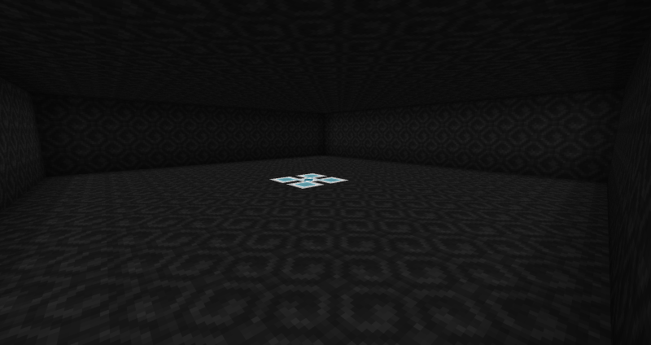

# Spectre Key

## Description

---

The Spectre Key grants you access to your own private room in the Spectre Dimension. Using it for 5 seconds (Like a bow) will teleport you to a room that at the beginning is 16*16*4 big. In the middle of the room you will find the Spectre Core, right clicking more [Ectoplasm](ectoplasm) on it will increase the rooms height (1 per [Ectoplasm](ectoplasm)), in theory you can make your room go as high as the height limit allows. If you use the Spectre Key while in your room it will teleport you back to the position you came from.

The Spectre Core is an unbreakable block that serves as the foundation of your Spectre Cube. It cannot be destroyed by explosions or entities and automatically adjusts its orientation based on surrounding Spectre Blocks. Right-clicking the core with an empty hand while in the Spectre Dimension teleports you back to the overworld.

Spectre Blocks are unbreakable, translucent blocks used to construct and expand Spectre Cubes. They work together with Spectre Cores to form the structure of your personal dimensional space. Like Spectre Cores, they cannot be destroyed by explosions or entities.

The Spectre Energy Injector is a block used for managing energy systems within Spectre Cubes. It is owned by the player who places it and is used to inject energy into Spectre-related systems and devices. The injector is translucent and requires proper setup within Spectre Cubes to function effectively.

You can place anything you want in your spectre cube, it will be easily accessible from anywhere using your key. You **cannot** access the rooms of other players unless you are in creative mode.

## Crafting

---

## Screenshots

---

