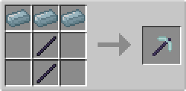
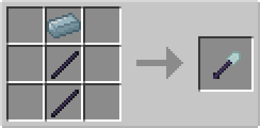
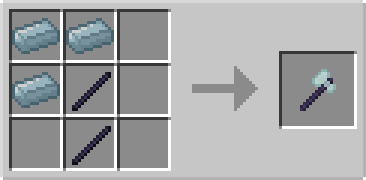

# Spectre Tools

## Description

---

Using Spectre Ingots, crafted from [Ectoplasm](ectoplasm) you can craft Spectre versions of vanilla tools. All of these tools have higher durability & enchantability than their diamond counterpart. The Spectre Pickaxe / Axe / Shovel and Hoe all increase your block range by 3 while holding them. The Spectre Sword is able to hurt Spirits, so you don’t need to use magic to kill them anymore.

## Crafting

---

