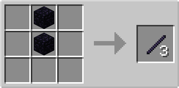
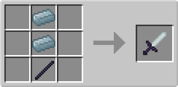
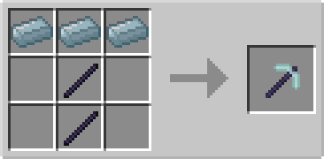
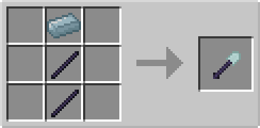
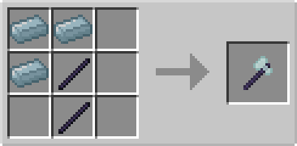
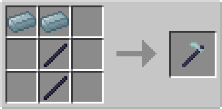

# Spectre Tools

## Description

---

Using Spectre Ingots, crafted from [Ectoplasm](ectoplasm) you can craft Spectre versions of vanilla tools. All of these tools have higher durability & enchantability than their diamond counterpart. The Spectre Pickaxe / Axe / Shovel and Hoe all increase your block range by 3 while holding them. The Spectre Sword is able to hurt Spirits, so you don’t need to use magic to kill them anymore.

### Tool Statistics

| Tool            | Attack Damage | Attack Speed | Durability | Harvest Level    | Mining Speed | Special         |
| --------------- | ------------- | ------------ | ---------- | ---------------- | ------------ | --------------- |
| Spectre Sword   | 7.0           | 1.6          | 2000       | -                | -            | Damages Spirits |
| Spectre Pickaxe | 5.0           | 1.2          | 2000       | 3 (Diamond tier) | 8.0          | +3 reach        |
| Spectre Axe     | 9.0           | 1.0          | 2000       | 3 (Diamond tier) | 8.0          | +3 reach        |
| Spectre Shovel  | 5.5           | 1.0          | 2000       | 3 (Diamond tier) | 8.0          | +3 reach        |
| Spectre Hoe     | 1.0           | 4.0          | 2000       | 3 (Diamond tier) | 8.0          | +3 reach        |

## Crafting

---

