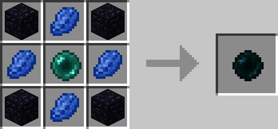

# Stable Ender Pearl

## Description

---

While Stable Ender Pearls are used in various crafting recipes they also have a purpose on their own.

When you you right click a stable ender pearl in your hand it will be bound to you. When it’s dropped on the ground it will teleport the player it’s bound to to itself after 7 seconds.
If it’s not bound to anyone it will instead teleport a random entity in a 10 block radius to itself.

## Crafting

---

## Videos

---

<video controls>
  <source src="../videos/stable-ender-pearl.mp4" type="video/mp4">
</video>