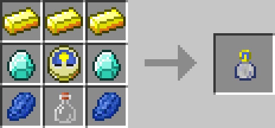

# Time in a Bottle

## Description

---

This item allows you to accelerate the rate at which blocks tick. It passively collects time while in your inventory which you can consume by right clicking a block with it. The first click requires 30 Seconds, the second 60, the third 120 the fourth 240 and the fifth 480. The speed at which the block ticks doubles with each click. The effect lasts 30 seconds. Time is stored globally per player, so all your bottles draw from the same pool.

## Crafting

---

## Videos

---

<video controls>
  <source src="../videos/time-in-a-bottle.mp4" type="video/mp4">
</video>