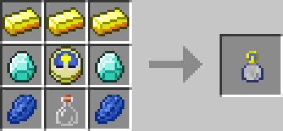

# Time in a Bottle

## Description

---

This item allows you to accelerate the rate at which blocks tick. It passively collects time while in your inventory which you can consume by right clicking a block with it. The first click requires 30 Seconds, the second 60, the third 120 the fourth 240 and the fifth 480. The speed at which the block ticks doubles with each click. The effect lasts 30 seconds. Time is stored globally per player, so all your bottles draw from the same pool.

## Commands

You can use the following commands to manage the stored time in a bottle:

- `/rt timeinabottle <playername> <add|query|set|subtract> <time><s|m|h|d>`
- `/qt timeinabottle transfer <playername> <time><s|m|h|d>`

By default, time is interpreted as seconds. You can use the following suffixes to specify the unit: s, m, h, d. The command can be used by any players with operator permissions, and is meant to replace the old nbt system, where time could be read and changed from the item nbt.

Players can use the transfer command to move their stored time directly to another player. Any player can execute this command, regardless of operator status. In legacy mode, both the source and target player must have a Time in a Bottle in their inventory.

### Examples

- `/rt timeinabottle player add 10m` - Add 10 minutes to player's Time in a Bottle.
- `/rt timeinabottle player query` - Query the stored time in a bottle for player.
- `/rt timeinabottle player set 1h` - Set the stored time in a bottle for player to 1 hour.
- `/rt timeinabottle player subtract 30s` - Subtract 30 seconds from player's Time in a Bottle.
- `/qt timeinabottle transfer player 10m` - Transfer up to 10 minutes of your stored time to player.

## Crafting

---

## Videos

---

<video controls>
  <source src="../videos/time-in-a-bottle.mp4" type="video/mp4">
</video>
