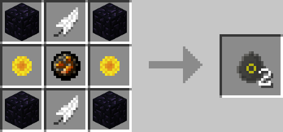
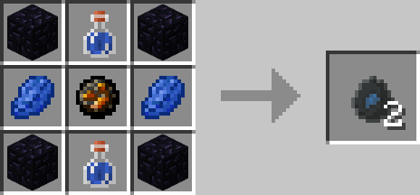
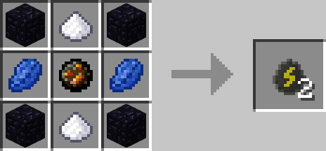
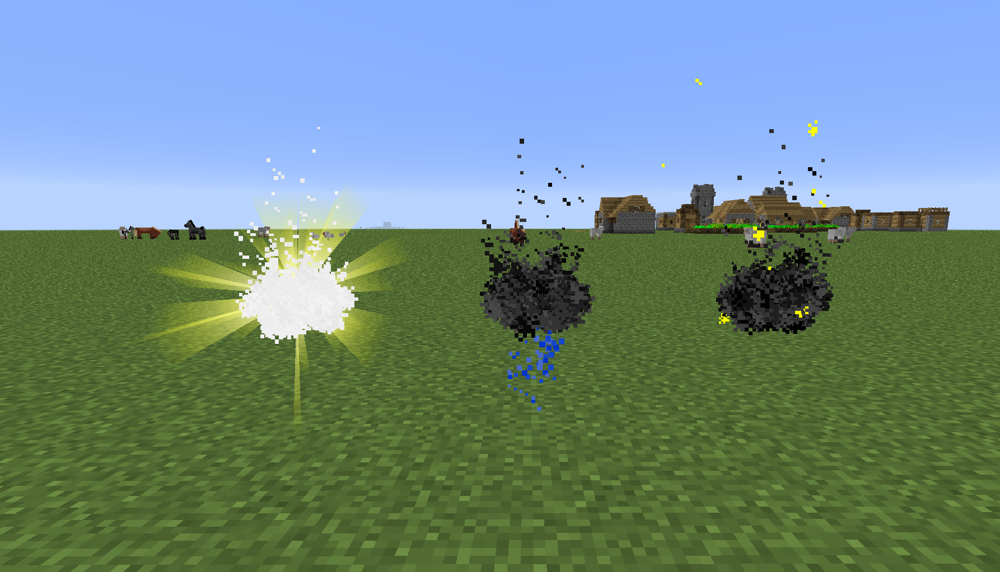

# Weather Eggs

## Description

---

When thrown Weather Eggs will spawn a small cloud that will start to slowly go upwards. Once it reaches the sky it will change the weather to the type of the egg (Sunny, Rain, Thunderstorm).

## Crafting

---

## Screenshots

---

