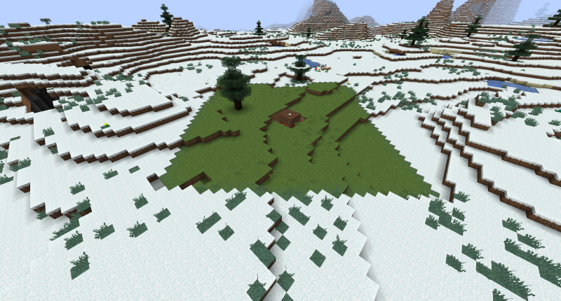

<!-- TODO: Verify biome transformation mechanics and explosion behavior -->
---
title: Ancient Furnace
category: other
---

# Ancient Furnace

## Description

---

You can rarely stumble upon Ancient Furnaces hidden away in cold biomes. These mysterious structures are built from Ancient Bricks, which come in several decorative variants: runes, default, star empty, star full, and output. Ancient Bricks are incredibly durable - nothing can destroy them, not even explosions or powerful entities. They're also smart enough to automatically melt any snow that falls on them.

To activate an Ancient Furnace, you need to find an Ancient Brick with the star empty pattern and right-click it with a Nether Star. This converts it to star full and wakes up any Ancient Furnace sitting below it. Once activated, the furnace starts heating up and will transform a huge area (10,000 blocks by default, though this can be changed in the config) around it into a warmer biome, melting away all the surface snow in the process. Be warned - once it finishes its work, the furnace will explode, so make sure you're ready for that!

## Screenshots

---

