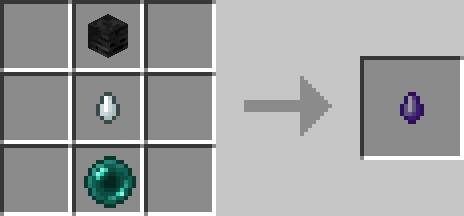
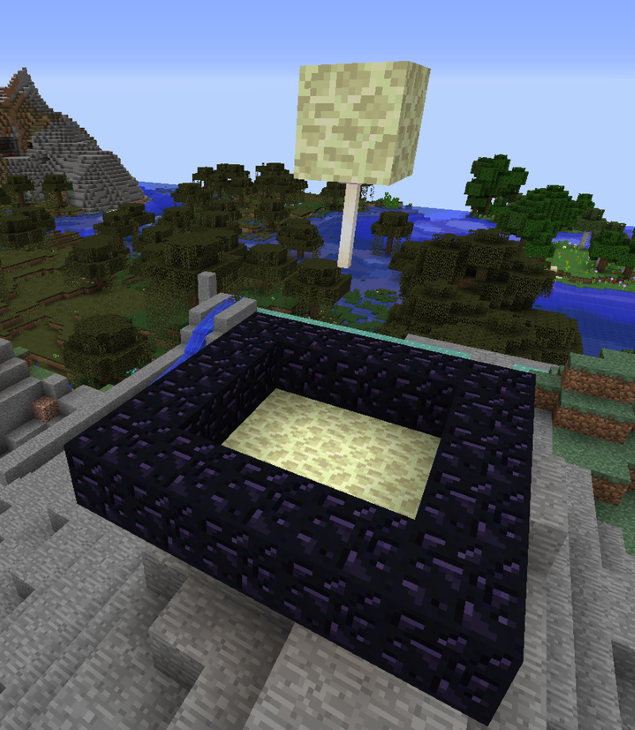
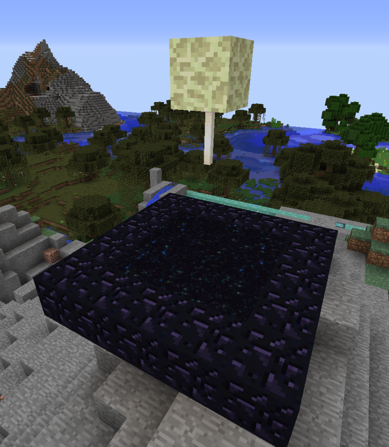

# Artificial End Portal

## Description

---

With Quantum Things installed you no longer have to run to the nearest Fortress to get to the end (Once you’ve been there anyway :P). You can just build your own End Portal. Build the Structure shown in the first Screenshot and right click the End Rod with an Evil Tear, the portal will then open. The second screenshot shows the portal after it has been opened, the structure has to stay intact or otherwise the portal will close again & you will have to use another evil tear to reopen it.

## Crafting

---

## Screenshots

---

