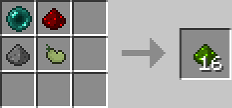
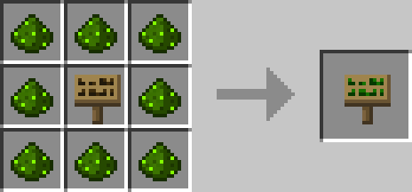
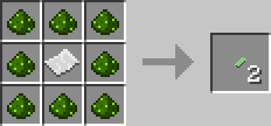
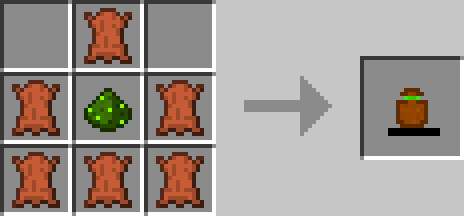
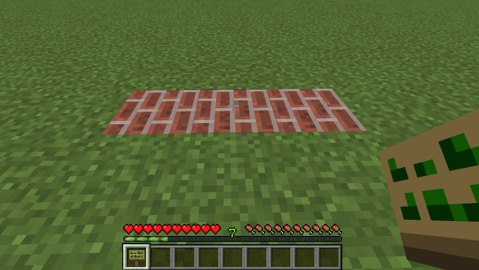
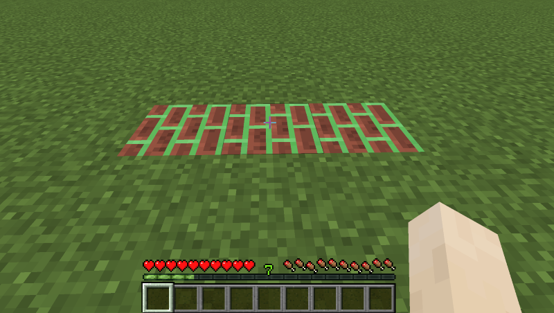
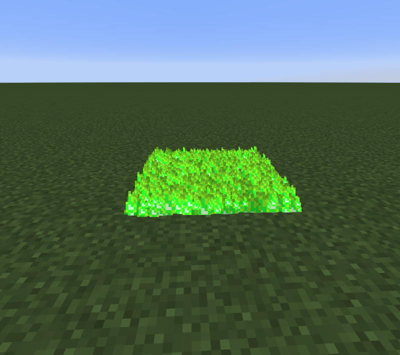

<!-- TODO: Verify teleportation mechanics and naming system -->
---
title: Floo Teleportation
category: other
---

# Floo Teleportation

## Description

---

The Floo Network lets you teleport between special fireplaces by speaking their names. To create a Floo Fireplace, right-click a connected line of brick blocks with a Floo Sign. This turns the bricks into Floo Bricks and sets up your new teleportation point. You can rename the Floo Sign in an anvil before using it to give your fireplace a custom name - this is the name you'll say to teleport to it later.

To use the network, hold some Floo Powder in your hand and stand on top of any Floo Bricks. Then type the name of the fireplace you want to visit in chat, and you'll be whisked away to the fireplace with the closest matching name. If a fireplace doesn't have a name, you can still use it to teleport from, but you can't teleport to it. When you arrive, you'll be facing the opposite direction from how the fireplace creator was facing when they set it up.

Floo Tokens let you use the network on the go without needing a permanent fireplace nearby. Just throw a token on the ground and wait a moment - a temporary fireplace will appear that works just like a regular one. Perfect for quick escapes or exploring new areas.

Carrying Floo Powder around can be annoying, so you can craft a Floo Pouch to store up to 128 Floo Powder. Keep it anywhere in your inventory, and when you need to refill it, just shift-right-click to automatically pull Floo Powder from your inventory into the pouch.

## Crafting

---

## Screenshots

---

